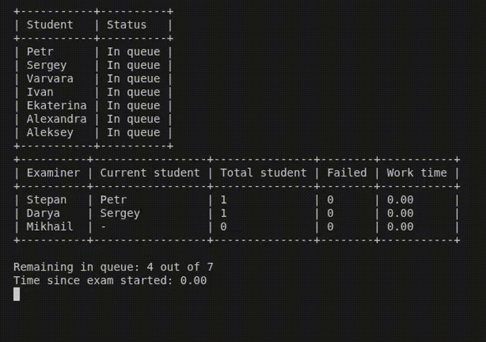

# Real-Time Exam Simulation

A concurrent real-time simulation of an examination process with multiple examiners working on a shared student queue.

The project was originally developed as a programming assignment and subsequently organized as a standalone portfolio project. The implementation focuses on concurrency, state management, probabilistic behavior, object-oriented design, and real-time terminal monitoring.

---

## Features

* Multiple examiners working concurrently
* Shared thread-safe student queue
* Automatic assignment of students to available examiners
* Real-time terminal display
* Randomized exam duration based on examiner name length
* Probabilistic student answer selection based on the golden ratio
* Different answer-selection distributions for male and female students
* Multiple possible correct answers per question
* Probabilistic examiner mood
* Periodic examiner lunch breaks
* Per-student and per-examiner statistics
* Final performance rankings and exam statistics
* Plain-text input data
* Standard library only

---

## Demo



---


## How It Works

The simulation starts by loading examiners, students, and questions from text files.

Students are placed into a shared queue. Each examiner runs in a separate worker thread and takes the next available student whenever they are free.

While the exam is running, another thread continuously updates the terminal with the current state of the simulation.

The simulation ends when every student has completed their exam.

### Exam

Each student answers three different questions.

For every question:

1. The student selects one word from the question according to a probability distribution.
2. The examiner selects one or more words as correct answers.
3. The student's answer is considered correct if it matches one of the examiner's selected answers.

The final result depends on the examiner's randomly selected mood:

* **Bad mood** — the student automatically fails.
* **Good mood** — the student automatically passes.
* **Neutral mood** — the student passes if at least two of the three answers are correct.

### Examiner Breaks

Examiners periodically become eligible for a lunch break after reaching a work-time threshold.

A break starts only after the current exam is finished and lasts for a random duration between 12 and 18 seconds.

Longer simulations may therefore include multiple breaks for the same examiner.

### Exam Duration

The duration of an exam is determined by the examiner's name length.

For an examiner with `N` letters, the duration is randomly chosen between:

```text
N - 1 and N + 1 seconds
```

For example, an examiner named `Stepan` has 6 letters, so an exam lasts between 5 and 7 seconds.

---

## Input

The simulation uses three files located in `src/exam_simulation/data/`.

### `examiners.txt`

```text
Stepan M
Darya F
Mikhail M
```

Each line contains an examiner's name and gender.

### `students.txt`

```text
Petr M
Sergey M
Varvara F
Ivan M
Ekaterina F
Alexandra F
Aleksey M
```

Students are initially added to the shared queue in file order.

### `questions.txt`

```text
There is a table
A man is a dog's friend
Solar eclipses affect people
Programming is an interesting activity
```

Each line represents a question.

### Custom Input Data

You can replace the provided data with your own students, examiners, and questions. The input files can be edited directly as long as they follow the expected format.

---

## Real-Time Display

During the simulation, the terminal shows:

* current status of every student
* queue order
* current student assigned to each examiner
* number of students examined by each examiner
* number of failed students
* examiner work time
* remaining students in the queue
* elapsed simulation time

The display is refreshed in place rather than continuously printing new screens.

---

## Final Statistics

After the simulation finishes, the program calculates:

* **Top-performing students** — students who completed their exams in the shortest time
* **Top examiners** — examiners with the lowest failure rate
* **Students to be expelled** — the fastest students among those who failed
* **Best questions** — questions answered correctly by the largest number of students
* **Overall result** — the exam succeeds if more than 85% of students pass

---

## Project Structure

```text
project/
│
├── src/
│   └── exam_simulation/
│       ├── main.py
│       ├── models/
│       │   ├── enums.py
│       │   ├── examiner.py
│       │   ├── person.py
│       │   ├── question.py
│       │   └── student.py
│       │
│       ├── services/
│       │   ├── exam_logic.py
│       │   ├── final_summary.py
│       │   └── simulation.py
│       │
│       └── utils/
│           ├── display.py
│           └── io.py
│
├── data/
│   ├── examiners.txt
│   ├── students.txt
│   └── questions.txt
├── docs/
│   ├── architecture.md
│   └── exam-simulation.gif
│
└── README.md
```

---

## Technologies

* Python 3
* `threading`
* `queue`
* `enum`
* `random`
* `time`

No external dependencies are required.

---

## Running

From the project directory:

```bash
cd src/
python3 -m exam_simulation
```

---

## Possible Improvements

The current implementation is functional, but several areas could be developed further:

* Add structural typing with `typing.Protocol`
* Add automated tests for exam logic and statistical calculations
* Improve input validation and error reporting
* Add configurable simulation parameters
* Improve thread lifecycle management
* Add logging
* Expand the final statistics
* Improve terminal rendering

---

## Project Scope

The project focuses on modeling a concurrent system rather than reproducing a real examination platform.

The main goal is to keep the simulation logic, domain models, orchestration, input handling, and presentation separate while allowing multiple examiners to operate concurrently on a shared queue.
